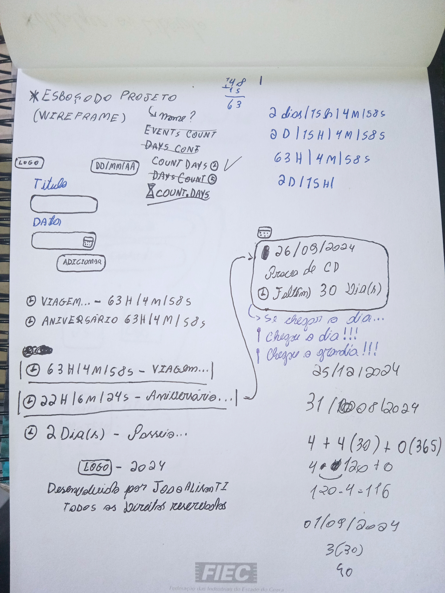
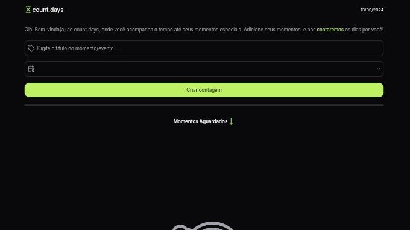
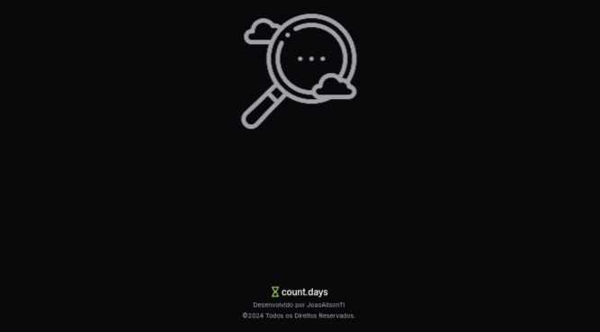
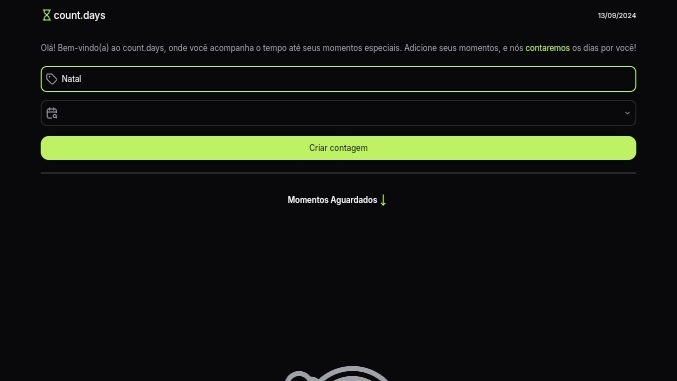
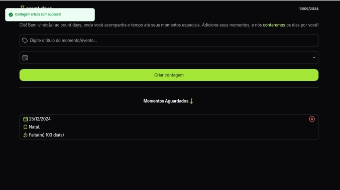
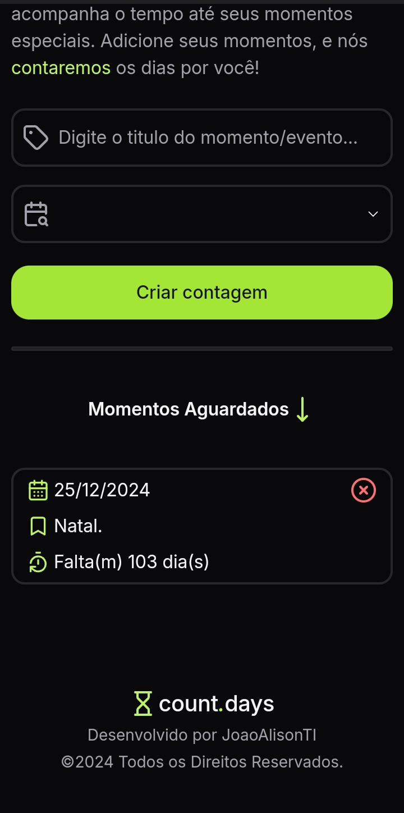

<h2 align="center">count.days</h2>

Desenvolvido em 2024 para ajudar os usuários a acompanhar o tempo até seus momentos especiais(ou não😅) 🗓️⏳.  

- [Visão geral](#visão-geral)
  - [Sobre o projeto](#sobre-o-projeto)
  - [Screenshots](#screenshots)
  - [Links](#links)
- [Meu processo](#meu-processo)
  - [Tecnologias](#tecnologias)
  - [Funcionalidades](#funcionalidades)
  - [Continuar o desenvolvimento](#continuar-o-desenvolvimento)
  - [Recursos úteis](#recursos-úteis)
- [Autor](#autor)

 

## Visão geral
### Sobre o projeto
count.days é uma aplicação web onde os usuários podem adicionar e acompanhar a contagem regressiva para seus momentos e eventos importantes. O projeto foi desenvolvido para praticar conceitos de desenvolvimento web, gerenciamento de estado, e manipulação de datas em React.js.

### Screenshots

  

  

  

  

  

  

### Links
- [Acesse o projeto finalizado, online ☁️](https://count-days-to.vercel.app/)

 

## Meu processo
### Tecnologias
Esse projeto foi desenvolvido com as seguintes tecnologias:

- Vite.js para inicialização e criação do projeto
- React.js para estruturação do projeto
- JavaScript para lógica e interatividade
- Tailwind CSS para estilização
- Lucide Icons
- Git e Github para versionamento de código
- Trello para gerenciamento do projeto

### Funcionalidades

Requisitos Funcionais (RF):

1. RF01: A aplicação deve permitir que o usuário adicione um novo momento, especificando titulo e data.**(feito)**
2. RF02: A aplicação deve calcular e exibir o número de dias restantes até o dia do momento especificado.**(feito)**
3. RF03: A aplicação deve permitir que o usuário visualize todos os momentos adicionados em forma de cards.**(feito)**
4. RF04: A aplicação deve permitir que o usuário exclua um momento.**(feito)**
5. RF05: A aplicação deve exibir uma mensagem especial quando um momento chegar ao dia zero.**(feito)**
6. RF06: A aplicação deve permitir que o usuário edite os detalhes de um momento existente.
7. RF07: A aplicação deve ordenar os momentos automaticamente por proximidade da data.
8. RF08: A aplicação deve armazenar todos os momentos adicionados pelo usuário no Local Storage do navegador.**(feito)**
9. RF09: A aplicação deve recuperar e exibir os momentos armazenados no Local Storage ao carregar a página.**(feito)**
10. RF10: A aplicação deve atualizar o Local Storage sempre que um evento for adicionado, editado ou excluído.**(feito)**
11. RF11: A aplicação deve exibir uma notificação ao criar, editar ou excluir um momento.**(feito)**

Requisitos Não Funcionais (RNF):

1. RNF01: O sistema deve ser responsivo, funcionando em dispositivos móveis e desktops.**(feito)**
2. RNF02: A aplicação deve ser intuitiva e fácil de usar.**(feito)**

### Continuar o desenvolvimento
Futuras melhorias:
- Implementação de um backend para persistência de dados
- Implementação de lembretes por e-mail ou notificações push
- Opção de compartilhamento dos momentos com amigos

### Recursos úteis
- [React](https://reactjs.org/) - A biblioteca JavaScript para construir interfaces de usuário.
- [Vite](https://vitejs.dev/) - Ferramenta de build que visa proporcionar uma experiência de desenvolvimento mais rápida e leve.
- [Tailwind CSS](https://tailwindcss.com/) - Um framework CSS utility-first para criar designs personalizados rapidamente.
- [Lucide Icons](https://lucide.dev/) - Biblioteca de ícones open-source, sucessora do Feather Icons.
- [Trello](https://trello.com/) - Ferramenta de gerenciamento de projetos e colaboração em equipe.
- [MDN Web Docs](https://developer.mozilla.org/) - Excelente recurso para documentação de HTML, CSS e JavaScript.
- [MDN - Local Storage](https://developer.mozilla.org/en-US/docs/Web/API/Window/localStorage) - Documentação específica sobre o uso de localStorage em aplicações web.

 

## Autor
*JoaoAlisonTI 👨🏽‍💻*

---

<strong>2024</strong>